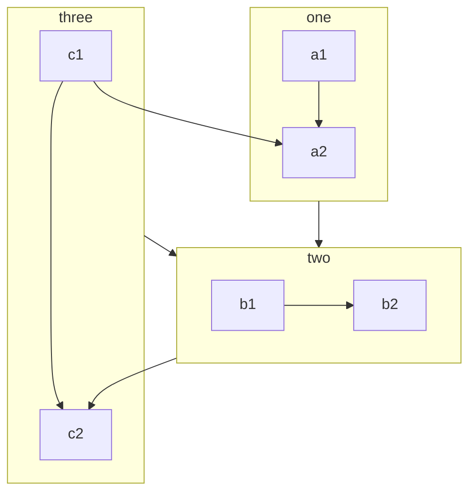
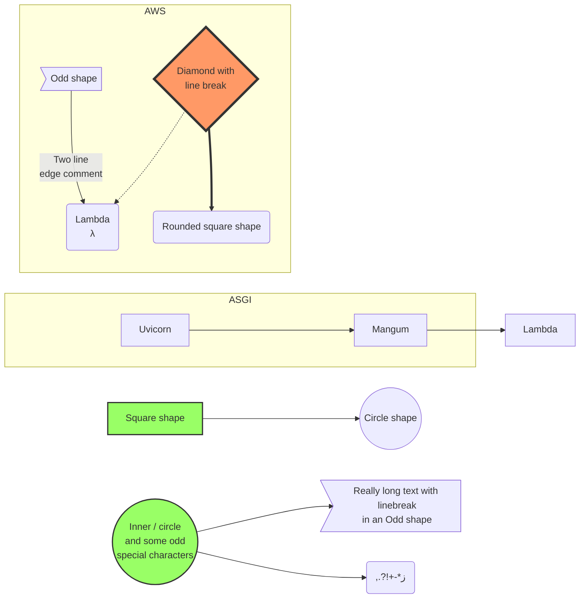

```mermaid
flowchart TB
    c1-->a2

    subgraph one
        a1-->a2
    end

    subgraph two
        b1-->b2
    end

    subgraph three
        c1-->c2
    end

    one --> two
    three --> two
    two --> c2
```

```mermaid
flowchart LR
    subgraph ASGI
        Uvicorn --> Mangum
    end

    sq[Square shape] --> ci((Circle shape))

    Mangum --> Lambda

    subgraph AWS
        od>Odd shape]-- Two line<br/>edge comment --> ro
        di{Diamond with <br/> line break} -.-> ro(Lambda<br>λ)
        di==>ro2(Rounded square shape)
    end

    %% Notice that no text in shape are added here instead that is appended further down
    e --> od3>Really long text with linebreak<br>in an Odd shape]

    %% Comments after double percent signs
    e((Inner / circle<br>and some odd <br>special characters)) --> f(,.?!+-*ز)

    classDef green fill:#9f6,stroke:#333,stroke-width:2px;
    classDef orange fill:#f96,stroke:#333,stroke-width:4px;
    class sq,e green
    class di orange
```
