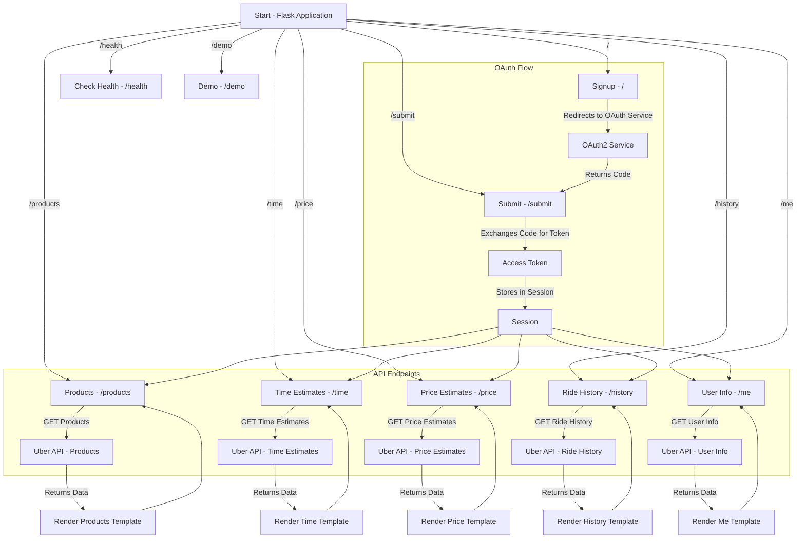

### Copilot-generated mermaid diagram

```mermaid
flowchart TD
    Start[Start - Flask Application] -->|"/health"| HealthCheck[Check Health - /health]
    Start -->|"/"| Signup[Signup - /]
    Start -->|"/submit"| Submit[Submit - /submit]
    Start -->|"/demo"| Demo[Demo - /demo]
    Start -->|"/products"| Products[Products - /products]
    Start -->|"/time"| TimeEstimates[Time Estimates - /time]
    Start -->|"/price"| PriceEstimates[Price Estimates - /price]
    Start -->|"/history"| History[Ride History - /history]
    Start -->|"/me"| Me[User Info - /me]

    subgraph "OAuth Flow"
        Signup -->|Redirects to OAuth Service| OAuthService[OAuth2 Service]
        OAuthService -->|Returns Code| Submit
        Submit -->|Exchanges Code for Token| AccessToken[Access Token]
        AccessToken -->|Stores in Session| SessionStorage[Session]
    end

    subgraph "API Endpoints"
        Products -->|GET Products| UberAPIProducts[Uber API - Products]
        TimeEstimates -->|GET Time Estimates| UberAPITime[Uber API - Time Estimates]
        PriceEstimates -->|GET Price Estimates| UberAPIPrice[Uber API - Price Estimates]
        History -->|GET Ride History| UberAPIHistory[Uber API - Ride History]
        Me -->|GET User Info| UberAPIMe[Uber API - User Info]
    end

    SessionStorage --> Products
    SessionStorage --> TimeEstimates
    SessionStorage --> PriceEstimates
    SessionStorage --> History
    SessionStorage --> Me

    UberAPIProducts -->|Returns Data| RenderProducts[Render Products Template]
    UberAPITime -->|Returns Data| RenderTime[Render Time Template]
    UberAPIPrice -->|Returns Data| RenderPrice[Render Price Template]
    UberAPIHistory -->|Returns Data| RenderHistory[Render History Template]
    UberAPIMe -->|Returns Data| RenderMe[Render Me Template]

    RenderProducts --> Products
    RenderTime --> TimeEstimates
    RenderPrice --> PriceEstimates
    RenderHistory --> History
    RenderMe --> Me
```